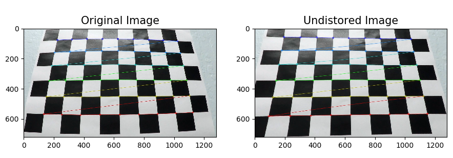
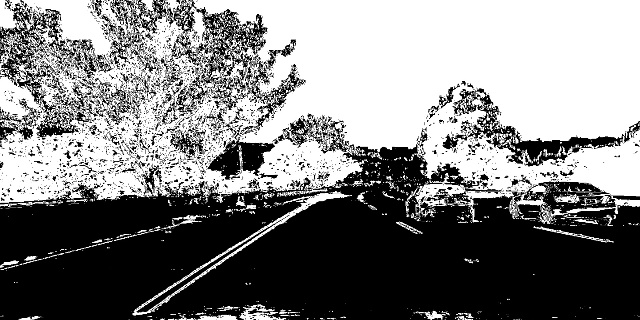
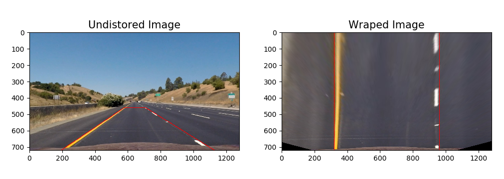
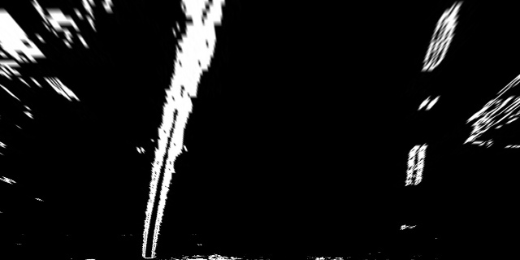
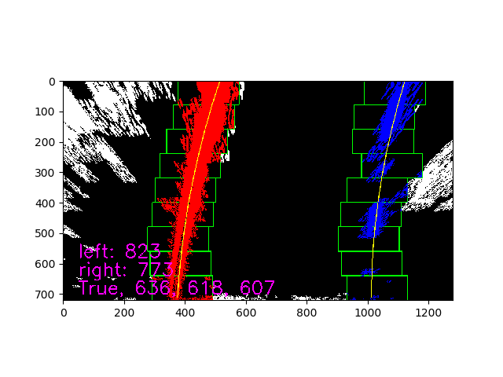
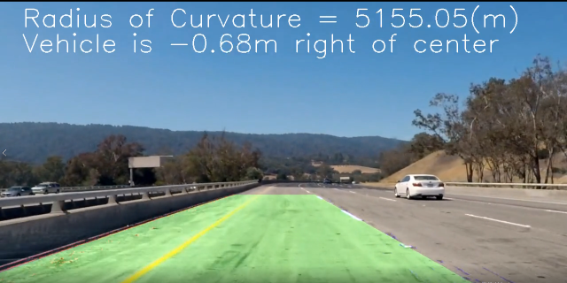
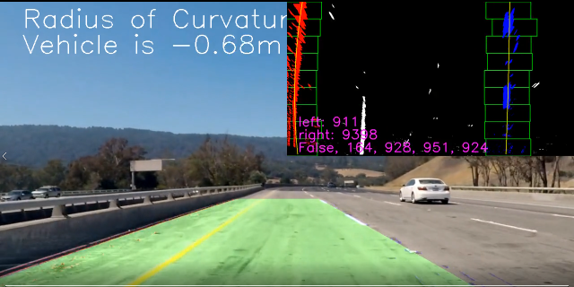
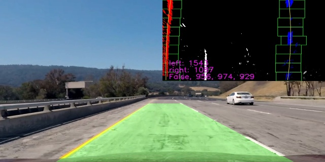

**Advanced Lane Finding Project**

Note: this is Udacity Nano Degree project, please refer to [Udacity Repository](https://github.com/udacity/CarND-Advanced-Lane-Lines.git) for the project information and requirements.

The goals / steps of this project are the following:

* Compute the camera calibration matrix and distortion coefficients given a set of chessboard images.
* Apply a distortion correction to raw images.
* Use color transforms, gradients, etc., to create a thresholded binary image.
* Apply a perspective transform to rectify binary image ("birds-eye view").
* Detect lane pixels and fit to find the lane boundary.
* Determine the curvature of the lane and vehicle position with respect to center.
* Warp the detected lane boundaries back onto the original image.
* Output visual display of the lane boundaries and numerical estimation of lane curvature and vehicle position. 

---

### Camera Calibration

#### 1. use the **opencv** `findChessboardCorners()` and `calibrateCamera()` funtion to implement the camera calibration.

The code for this step in the `camera_calibration.py` which located in **camera_cal** folder.  
run the `camera_calibration.py` to process the calibration.

In the function calibriate(), the process as below:
* prepare the `objp[]`, which is same matrix as chessboard X6
* create list `objepiont[]` and `imgpionts[]` to hold the 3D and 2D pioints.
* go through all the calibration image to search for conerner. use opencv `findChessboardCorners` function.
* use opencv `calibratteCamera()` to get `mtx` and `dist` 
* write the calibration paramter to a pickle file *camera_cal.p*

To test if the pickle file which contain the 'mtx' and 'dist' work. use the `test()` function to test and visualize the result.
* read the pickle and load the `mtx` and `dist`
* read test image
* use `cv2.undistort()` to undistort the test image.
the result as below 



---

### Pipeline (single image)

`pipeline.py` include the class Pipeline, the function `pipeline()` which used to handle the image. You could run "pipeline.py" to see the pipeline effect.

The process described below:

#### 1. distortion-corrected image.

use the paremeter from pickle file *camera_cal.p* (this is done by the function: `get_camera_cal()`) use the `cv2.undistort` to get the undistort image,the image showed below(resized to 640X360 to fit the file.):


#### 2. Threshold the image.

All the image process code is in the `image_process.py`
in the pipeline it use the funtion import from `image_process.py`
```
s_thresh=(170,255)
sx_thresh=(20, 100)
image_threshed = color_grid_thresh(image_undist, s_thresh=s_thresh, sx_thresh=sx_thresh)
```
This is a combination of color and gradient thresholds to generate a binary image.
in color: it use a HLS's s channel, for gradient, use x direction gradient. 
the detialed code is in the `image_process.py`, function `color_grid_thresh`, after apply the threshold, the image as below.




#### 3. Perspective transform

To implement perspective tranform, first need get the tranform parameter `M` and `Minv`.
This is done by the `view_perspective.py`, just like camera_cal, get the parameter then write into a pickle file for further use.
You could run "view_perspective.py" to see the transform.

The view transform use manully adjust the 4 source piont.
after serveral times adjust, the 4 poinst as below.

```python
src = np.float32(
    [[(img_size[0] / 2) - 63, img_size[1] / 2 + 100],
    [((img_size[0] / 6) - 20), img_size[1]],
    [(img_size[0] * 5 / 6) + 60, img_size[1]],
    [(img_size[0] / 2 + 65), img_size[1] / 2 + 100]])
dst = np.float32(
    [[(img_size[0] / 4), 0],
    [(img_size[0] / 4), img_size[1]],
    [(img_size[0] * 3 / 4), img_size[1]],
    [(img_size[0] * 3 / 4), 0]])	
```


The wraped binary image as below




#### 4. Lane-line pixels detection and fit their positions with a polynomial

the `lane_detection.py` implement the lane-line pixels detection.
the function `find_lane_pixels()` use a slide window to find the lane-line pixels. 
after get the lane_pixels, use `np.polyfit()` to get polynomial paratmeters, this is done in `get_polynomial` in the example, it like below. `[A B C]`
```python
[ 1.42425935e-04 -3.09709625e-01  5.13026355e+02]
[ 1.96100345e-04 -2.96906479e-01  1.12235500e+03]
```

To visualize the search result and fit polynomial, use `fit_polynomial()` function. the visualized result as below. show the search window/lane pixels/fit polynimial.



#### 5. Calculate the radius of curvature of the lane and the position of the vehicle with respect to center.

The cacualtion is done in the `cal_curv.py`, the function `measure_curv()` used to calculate radius.

Firstly, transform the lane piont from pixels to meters,
```python
# Transform pixel to meters
leftx = leftx * xm_per_pix
lefty = lefty * ym_per_pix
rightx = rightx * xm_per_pix
righty = righty * ym_per_pix
```
then fit these data use `np.polyfit()`

After get the polynomial parameter, use the function R = (1+(2Ay+B)^2)^3/2 / (|2A|)

For the offset, it is similar, tranfer pixel to meter, compare the lane center with picture center to get offse. these are in the function `measure_offset()`


#### 6. Plot lane area and display the radius and offset.

In the `Pipeline` class, use below code to visualzie the lane and caculation. to avoid number quick jump in the screen, display the 15 frames average.
```python
def project_fit_lane_info(self, image, color=(0,255,255)):
		"""
	project the fited lane information to the image
	use last 15 frame average data to avoid the number quick jump on screen.
	"""
	offset = np.mean(self.offset[-15:-1]) if len(self.offset) > self.smooth_number else np.mean(self.offset)
	curverad = np.mean(self.radius[-15:-1]) if len(self.radius) > self.smooth_number else np.mean(self.radius)
	direction = "right" if offset < 0 else "left"
	str_cur = "Radius of Curvature = {}(m)".format(int(curverad))
	str_offset = "Vehicle is {0:.2f}m ".format(abs(offset)) + "{} of center".format(direction)
	cv2.putText(image, str_cur, (50,60), cv2.FONT_HERSHEY_SIMPLEX,2,color,2)
	cv2.putText(image, str_offset, (50,120), cv2.FONT_HERSHEY_SIMPLEX,2,color,2)
```

The result as below picture.


In the pipeline.py, you could go to line 487 to 498, choice test on one image or a batch of image to see how the pipeline work.
```python
if __name__ == '__main__':
	"""
	image_test_tracker(), test pipeline on one image and show the image on screen
	images_test_tracker(), test pipeline on images and write the result to related folder
	"""
	image_test_tracker("./test_images/test6.jpg", "project", debug_window=False)
	# image_test_tracker("test_images/challenge/1.jpg", "challenge", debug_window=True)
	# image_test_tracker("test_images/harder/1.jpg", "harder", debug_window=True)

	# images_test_tracker("test_images/", "output_images/", "project", debug_window=True)
	# images_test_tracker("test_images/challenge/", "output_images/challenge/", "challenge", debug_window=True)
	# images_test_tracker("test_images/harder/", "output_images/harder/", "harder", debug_window=True)
```

---

### Pipeline (video)

To apply the pipeline on the video, you could run the gen_video.py. to generate video. the option is explained in the document description.
the code is in line 66-84
```python
if __name__ == "__main__":
	"""
	choise one line to uncoment and run the file, gen the video.
	the video will be output to ./outpu_videos/temp/
	option: subclip = True, just use (0-5) second video, False, use total long video.
	option: debug_window = True, project the debug window on the up-right corner of the screen to visualize the image handle process
								and write the fit lane failure/search lane failure image to ./output_videos/temp/images
	"""
	# get_image("./test_video/challenge_video.mp4", "./test_images/challenge/", [i for i in range(1,16)])
	# get_image("./test_video/harder_challenge_video.mp4", "./test_images/harder/", [i for i in range(1,47)])

	gen_video_tracker("project_video.mp4", subclip=True, debug_window=True) 
	# gen_video_tracker("project_video.mp4", subclip=False, debug_window=False)

	# gen_video_tracker("challenge_video.mp4", subclip=True, debug_window=True) 
	# gen_video_tracker("challenge_video.mp4", subclip=False, debug_window=True)
	
	# gen_video_tracker("harder_challenge_video.mp4", subclip=True, debug_window=True)
	# gen_video_tracker("harder_challenge_video.mp4", subclip=False, debug_window=False)
```


#### 1. Pipeline issue

With the image process established on single image. We couldn't get the left/right lane correctly in whole video.
there is always noise which will affect the lane detection.

For example, in some frame, the lan detection failed, as below picuture shows


The full size picture is [link to full size picture](./examples/project_detect_fail.png)


#### 2.  add debug window on the pictures.

To solve this problem, we need to know what happed when the process not work.
so I add a function `project_debug_window()` in the class, and we also need to check the fit lane(fitted polynomial) is OK or not.
To check the lane at y postion **720/bot, 360/mid, 0/top** the lane pixel distence and project to the final result picture for debug.
build the function `lane_sanity_check()` in `lane_detection.py`

```python
	lane_distance_bot = right_fitx[720] - left_fitx[720]
	lane_distance_mid = right_fitx[320] - left_fitx[320]
	lane_distance_top = right_fitx[0] - left_fitx[0]
```

The debug picture as below, the full size could find [here]

This is done by the class "Pipeline"'s function `project_debug_window()`

(./examples/project_detect_fail_with_debug.png)



When lane detect is False. use the recent data to project the lane area and culcualte the lane radius and car offset.
one detect failure and use recent data. As below picture show


#### 3 project video

Use the `Pipeline.pipeline()`, skip the noise frame, the pipeline work well on the project_video.mp4 well.

The project video is here [project_video.mp4](./output_video/project_video.mp4).
The videos with debug window could find here [project_video_with_debug_window.mp4](./output_video/project_video_with_debug_window.mp4).


#### 4. challenge video
To solve the challenge video problem. Improve the pipeline with image process.

The challenge vidoe could be find here [challenge_video.mp4](./output_video/challenge_video.mp4).

The challenge video with debug window could be found here [challenge_video_with_debug_window](./output_video/challenge_video_with_debug_window.mp4).


#### 5. harder chanllenge
The main change of pipeline for harder_challenge compare with challenge is the image process, the search method is also changed. 

The harder challenge vidoe could be find here [harder_challenge_video.mp4](./output_video/harder_challenge_video.mp4).

The harder challenge video with debug window could be found here [harder_challenge_video_with_debug_window.mp4](./output_video/harder_challenge_video_with_debug_window.mp4).

---

### Discussion

#### 1. the time/efficiency issue

`find_lane_pixels()` (helpers/lane_detection.py) is used to search the whole warped image to find the lane pionts.

The pipeline handle the image off-line, so not consider the efficiency issue. In real application, the pipeline must hanle the image before the next image arrive. a quick search method should be applied. 

#### 2. lane_sanity check
The `lane_sanity_check()` (helpers/lane_detection.py) function is very simple. To check if the fitted polynomial lines, just compare the fitted lines three y postions x distence to check if the fitted lines is OK. this is not work very well when the lane curve change dramticlly just like the in the harder_challenge video.

---

### Folders and Files

* **camera_cal** the code which calibration the camera
* **examples** some example pictures
* **helper** all the functions which used in **pipeline.py** and **video.py**
* **output_images** the images which processed by diff function.
* **output_video** the video has finished
* **test_images** the images used to test the pipeline
* **test_video** three video for testing the lane detection

* **pipeline.py** the code which use to hande the images. the actual lane dection happend.
* **requirements.txt** the python package list in local machine
* **gen_video.py** the code with use "pipeline" to handle the vidoe and generate the output video.