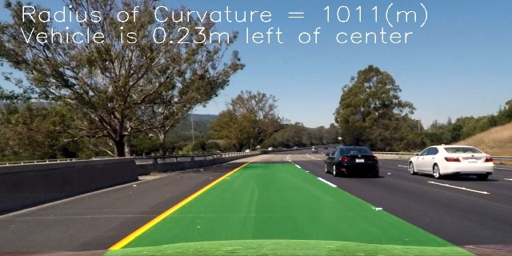

**Advanced Lane Finding Project**

Note: this is Udacity Nano Degree project, please refer to [Udacity Repository](https://github.com/udacity/CarND-Advanced-Lane-Lines.git) for the project information and requirements.

The goals / steps of this project are the following:

* Compute the camera calibration matrix and distortion coefficients given a set of chessboard images.
* Apply a distortion correction to raw images.
* Use color transforms, gradients, etc., to create a thresholded binary image.
* Apply a perspective transform to rectify binary image ("birds-eye view").
* Detect lane pixels and fit to find the lane boundary.
* Determine the curvature of the lane and vehicle position with respect to center.
* Warp the detected lane boundaries back onto the original image.
* Output visual display of the lane boundaries and numerical estimation of lane curvature and vehicle position.


## [Rubric](https://review.udacity.com/#!/rubrics/571/view) Points

### Here I will consider the rubric points individually and describe how I addressed each point in my implementation.  

---

### Camera Calibration

#### 1. use the **opencv** `findChessboardCorners()` and "`calibrateCamera()` funtion to implement the camera calibration.

The code for this step in the `camera_calibration.py` which located in **camera_cal** folder.  

In the function main(), the proces as below:
* prepare the `objp[]`, which is same matrix as chessboard X6
* create list `objepiont[]` and `imgpionts[]` to hold the 3D and 2D pioints.
* go through all the calibration image to search for conerner. use opencv `findChessboardCorners` function.
* use opencv `calibratteCamera()` to get `mtx` and `dist` 
* write the calibration paramter to a pickle file *camera_cal.p*

To test if the pickle file which contain the 'mtx' and 'dist' work. use the `test()` function to test and visualize the result.
* read the pickle and load the `mtx` and `dist`
* read test image
* use `cv2.undistort()` to undistort the test image.
the result as below 


### Pipeline (single images)

`pipeline.py` include the function `pipeline()` which used to handle the image, the process described below:

#### 1. distortion-corrected image.

use the paremeter from pickfel *camera_cal.p* (this is done by the function: `get_camera_cal()`) use the `cv2.undistort` to get the undistort image,the image showed below(resized to 640X360 to fit the file.):


#### 2. Threshold the image.

all the image process code is in the `image_process.py`
in the pipeline it use the funtion import from `image_process.py`
```
s_thresh=(170,255)
sx_thresh=(20, 100)
image_threshed = color_grid_thresh(image_undist, s_thresh=s_thresh, sx_thresh=sx_thresh)

```
this is a combination of color and gradient thresholds to generate a binary image.
in color: it use a HLS's s channel, for gradient, use x direction gradient. 
the detialed code is in the `image_process.py`, function `color_grid_thresh`, after apply the threshold, the image as below.


#### 3. perspective transform

to implement perspective tranform, first need get the tranform parameter `M` and `Minv`.
This is done by the `view_perspective.py`, just like camera_cal, get the parameter then write into a pickle file for further use.

the view transform use manully adjust the 4 source piont.
after server time adjust, the 4 poinst as below.

```python
src = np.float32(
    [[(img_size[0] / 2) - 63, img_size[1] / 2 + 100],
    [((img_size[0] / 6) - 20), img_size[1]],
    [(img_size[0] * 5 / 6) + 60, img_size[1]],
    [(img_size[0] / 2 + 65), img_size[1] / 2 + 100]])
dst = np.float32(
    [[(img_size[0] / 4), 0],
    [(img_size[0] / 4), img_size[1]],
    [(img_size[0] * 3 / 4), img_size[1]],
    [(img_size[0] * 3 / 4), 0]])	
```


To test the pickle file and tansform work well, use the test() function to test, the result is at [wrapped_color](./output_images/wraped_color)


#### 4. lane-line pixels detection and fit their positions with a polynomial

the `lane_detection.py` implement the lane-line pixels detection.
the function `find_lane_pixels()` use a slide window to find the lane-line pixels. 
after get the lane_pixels, use `np.polyfit()` to get polynomial paratmeters, this is done in `get_polynomial` in the example, it like below. `[A B C]`
```python
[ 1.42425935e-04 -3.09709625e-01  5.13026355e+02]
[ 1.96100345e-04 -2.96906479e-01  1.12235500e+03]
```

to visualize the search result and fit polynomial, use `fit_polynomial()` function. the visualized result as below. show the search window/lane pixels/fit polynimial.


#### 5. Calculate the radius of curvature of the lane and the position of the vehicle with respect to center.

the cacualtion is done in the `cal_curv.py`, the function `measure_curv()` used to calculate radius.

first, transform the lane piont from pixels to meters.
```python
# Transform pixel to meters
leftx = leftx * xm_per_pix
lefty = lefty * ym_per_pix
rightx = rightx * xm_per_pix
righty = righty * ym_per_pix
```
then fit these data use `np.polyfit()`

after get the polynomial parameter, use the function R = (1+(2Ay+B)^2)^3/2 / (|2A|)

for the offset, it is similar, tranfer pixel to meter, compare the lane center with picture center to get offse. these are in the function `measure_offset()`


#### 6. Plot lane area and display the radius and offset.

In the `pipeline`, use below code to visualzie the lane and caculation.
```python
# draw the lane to the undist image
	result = draw_lane_find(image_undist, image_warped, Minv, leftx, lefty, rightx, righty)
	result = draw_lane_fit(result, image_warped, Minv, left_fitx, right_fitx, ploty)

	# write curverad and offset on to result image
	direction = "right" if offset < 0 else "left"
	str_cur = "Radius of Curvature = {0:.2f}(m)".format(curverad)
	str_offset = "Vehicle is {0:.2f}m ".format(offset) + "{} of center".format(direction)
	cv2.putText(result, str_cur, (50,60), cv2.FONT_HERSHEY_SIMPLEX,2,(255,255,255),2)
	cv2.putText(result, str_offset, (50,120), cv2.FONT_HERSHEY_SIMPLEX,2,(255,255,255),2)

```

The result as below picture.


---

### Pipeline (video)

this is done by the `video.py`, generate the video using pipeline.

#### 1.video output

Here's a [link to my video result](./output_vidoe/project_video.mp4)

---

### Discussion

#### 1. the current pipeline don't has the check method to verify if the searched lane is correct or reasonal.

should check the founded lane is reasonable and discard the wrong finding.

---

### Folders and Files

* **camera_cal** the code which calibration the camera
* **examples** some example pictures
* **helper** all the functions which used in **pipeline.py** and **video.py**
* **output_images** the images which processed by diff function.
* **output_video** the video has finished
* **test_images** the images used to test the pipeline
* **test_video** three video for testing the lane detection

* **pipeline.py** the code which use to hande the images. the actual lane dection happend.
* **requirement.txt** the python package list in local machine
* **video.py** the code with use "pipeline" to handle the vidoe and generate the output video.