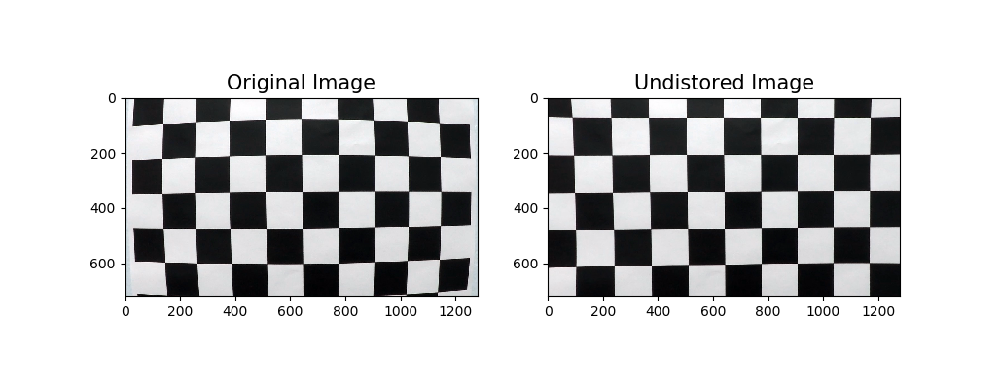

### Calibration the Camera

Using the chessboard images to calibrate the camera.
the calibration parameter will instore into a pickle file for further use.

#### Note:
the nx is the inner pionts in x direction
the ny is the inner points in y direction

#### Folders
* **chessboard_img**: the original chessboard_img
* **corners_founded**: the chessboard_img which find the correct corner numbers and drawed the corner.

#### Files
* **camera_balibration** the python scrip which used to calibration the camera.
* **camera_cal.p** the pickle file which instore the camera_cal parameters